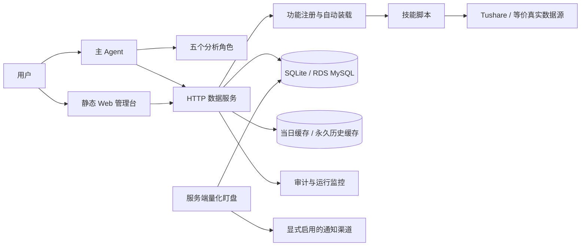

# 系统全景与审查结论

## 一眼结论

本工程已经形成“Agent 分析规范 + 数据服务 + 管理前端 + 数据库 + 定时任务”的完整闭环。量化选股、盘中盯盘、情绪分析和回测都具备明确数据边界；本轮补齐了就绪探针、模块装载报告、访客 Key 摘要存储、选股登记原子写入、筛选证据链事务、运行监控、日志生命周期和前端全时段规则。

生产流量应以 `/ready` 为准，`/health` 只作为兼容诊断快照。仍需后续治理的主要风险是正式数据库迁移体系、真实 MySQL/RDS 并发集成测试，以及日志外部归档和恢复演练。

## 系统全景

## 业务边界

- Agent 负责读规范、组织角色、解释证据和生成报告；它不是可执行任务队列，也不自行创建盘中循环。
- FastAPI 服务负责鉴权、数据读取、确定性计算、数据库持久化、服务端日终收口和量化盯盘。
- 前端只负责交互与展示，交易阶段与日期由上海服务时钟决定，服务端仍是最终权限和参数边界。
- SQLite 适合单机本地；RDS MySQL 用于云上多实例一致性。运行期数据和缓存均不进入 Git。

## 本轮已落地

| 等级 | 项目 | 结果 |
|---|---|---|
| 高 | 存活与就绪混用 | 新增 `/live`、`/ready`；Docker 和部署检查改用 `/ready` |
| 高 | 动态访客 Key 明文落库及列表返回 | 独立摘要表；旧明文自动迁移后删除；创建时仅返回一次完整值 |
| 高 | 选股登记并发竞态 | SQLite/MySQL 原生 upsert，自动/手动选股保持首次快照不可变 |
| 高 | 因子契约与筛选运行分两次提交 | 新增同事务 `save_screening_snapshot`，三类筛选统一使用 |
| 中 | 模块装载失败不可见 | `loader.report()` 保存导入成功与错误，`/ready` 据此拒绝流量 |
| 中 | 健康探针慢且有清理副作用 | 慢探测移出锁；缓存清理只在启动执行 |
| 中 | 量化候选逐股行情 N+1 | 改为最多六个交易日日截面批量读取，并返回覆盖与缺失摘要 |
| 中 | 前端时段、时区与局部刷新 | 上海时钟统一决策；行情局部刷新有进度、时间、Toast 和旧响应保护 |
| 中 | 正式环境缺少日常可读监控 | 五分钟探针 + 每晚中文汇总，记录接口和量化盯盘性能 |
| 中 | 业务拒绝与服务故障混计 | 4xx 业务拒绝单列，408/429/5xx 才计服务故障并影响整体状态 |
| 中 | 日志无限增长与容量不可见 | 默认保留 90 日、7 日后压缩，支持调查冻结和磁盘双阈值告警 |

## 仍需后续治理

| 风险 | 等级 | 当前边界与建议 |
|---|---|---|
| 数据库迁移仍为 `create_all + ALTER TABLE` | 高 | 多实例 DDL 竞争和迁移审计不足；应引入带版本、锁和回滚说明的迁移工具 |
| MySQL/RDS 并发语义未在真实环境集成测试 | 中 | 本地 SQLite 测试已覆盖；上线前验证 upsert 返回值、锁等待和事务隔离 |
| Agent 编排是文档协议而非任务执行引擎 | 中 | 适合受控分析；若要可靠并行、重试与恢复，应引入显式任务状态机 |
| 外部数据源可用性依赖权限与网络 | 中 | 数据失败必须失败并披露；只有文档允许的等价数据路径可标注降级使用 |
| 日志外部归档与恢复演练尚未落地 | 低 | 本机生命周期已闭环；生产环境仍应接入云日志/对象存储并定期验证恢复 |

## 准确性与实时性原则

1. 完整日因子只读取最近已确认数据日，盘中临时值不得写成日终事实。
2. 量化盯盘只保存当日聚合结论，不写正式选股、预测或完整日因子。
3. 数据响应必须带来源、获取时间、有效日期和缺失项；拿不到的数据不得推断补齐。
4. 涨价和业绩结论至少两个独立来源交叉验证；单一来源必须明确标注。
5. 数据类失败不以猜测兜底；资讯类可多源搜索，但必须保留来源与时间。

## 审查范围

本轮覆盖 Agent 编排、FastAPI 服务、自动注册、前端全部业务入口、量化选股、趋势/行业筛选、量化盯盘、情绪分析、回测、SQLite/MySQL 持久化、缓存、鉴权、日志、Docker 与阿里云 systemd 部署。结论以 2026-07-19 当前代码为准。
