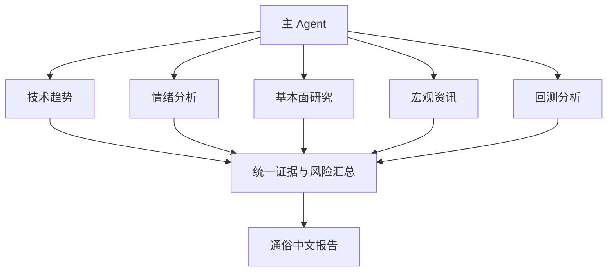
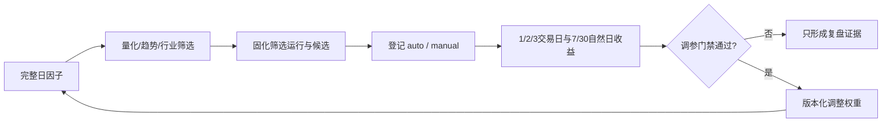
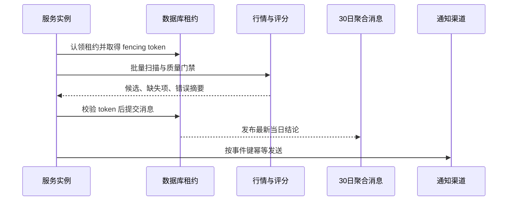
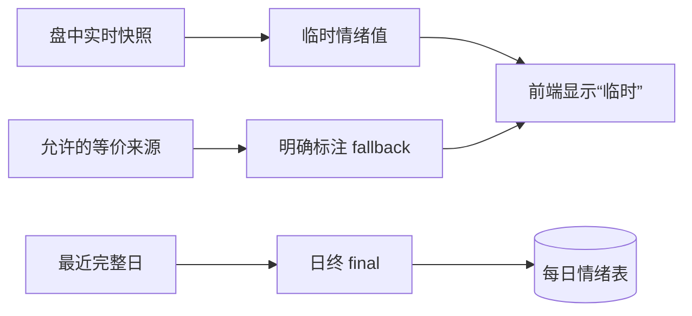

# Agent 编排与业务模块

## Agent 团队怎么工作

主 Agent 是唯一对用户负责的协调入口，按任务启用技术趋势、情绪、基本面、宏观资讯和回测五个分析角色。角色定义、交付字段和冲突处理写在 `agent/agents/`，属于可审计的分析协议，不是后台进程或消息队列。

- 重量任务：盘前、综合复盘、周/月回测、用户专题分析可启用团队。
- 17:30 当日总结由主 Agent 单跑，避免无必要的角色扩散。
- 竞价和盘中解释只在用户当前明确请求时执行一轮。
- 服务端量化盯盘可自动运行，但不会自动唤醒 Agent、写记忆或生成交易指令。

## 量化选股

量化选股读取当前因子契约匹配、覆盖率合格、同一运行批次的完整日快照。评分只负责排序，正式候选还要叠加“涨价 > 逻辑 > 预期炒作 > 情绪”的业务门禁。

关键保障：因子契约与筛选运行同事务写入；自动和用户触发样本隔离；调用方不能覆盖服务端固化的评分、排名和契约；候选行情按交易日批量补充并披露缺失。

## 量化盯盘

量化盯盘是服务端确定性线程，只在交易日连续竞价运行。数据库租约保证多实例只有一个执行者，fencing token 防止过期实例继续提交，通知事件键防止重复发送，WebSocket 全进程只保留一个广播等待任务，慢客户端只保留最新帧。

## 情绪分析策略

情绪温度综合市场宽度、涨跌停、指数/平均股价的动量、实体、振幅、行业扩散和成交变化。盘中值是临时快照，日终 `final` 才进入每日情绪事实表。极端指数和择时结果由服务端按固定规则计算，Agent 只解释，不自行改公式。

## 前端与后端模块

- 前端：量化选股、量化盯盘、行业、选股看板、自选、情绪、回测、预计算、权重配置。默认界面只给用户决策所需信息，诊断信息不得冒充业务结论。
- 后端：统一鉴权、功能分发、健康与就绪、数据库、缓存、日终调度、盯盘、审计和运行监控。
- 功能脚本：位于 `agent/skills/*/scripts/`，由 `service/loader.py` 自动导入并通过 `@register` 登记。
- 数据版本：功能索引内容变化自动改变 `data_version`；Agent 文档版本由 `AGENT_DOC_VERSION` 独立管理。

## 任务编号

现行 Agent 定时任务仅为 T1（08:30 盘前）、T2（17:30 当日总结）、T3（22:00 综合复盘）、W1、M1、P1。全市场因子收口由服务端交易日 16:00 执行，不再存在 Agent D1 任务；旧 T6/T7 只属于历史版本，不得重新注册。
