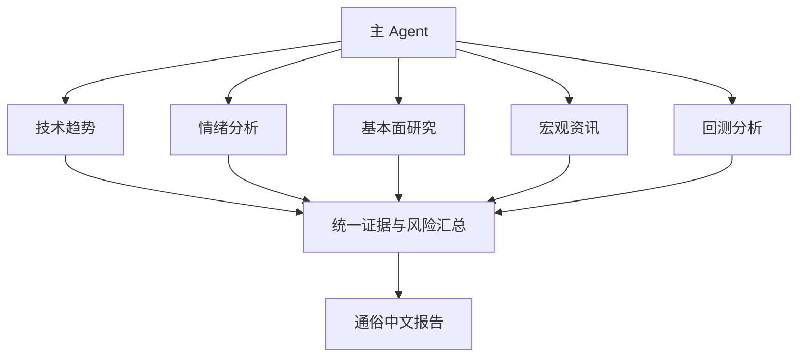
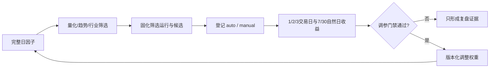
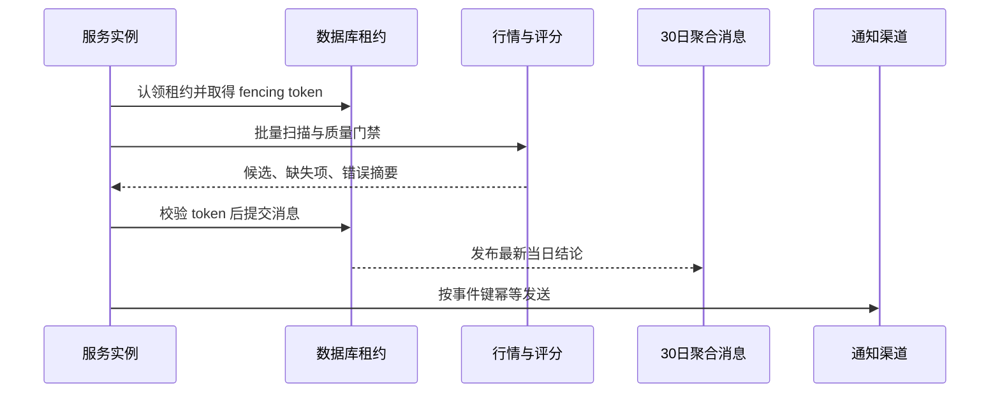
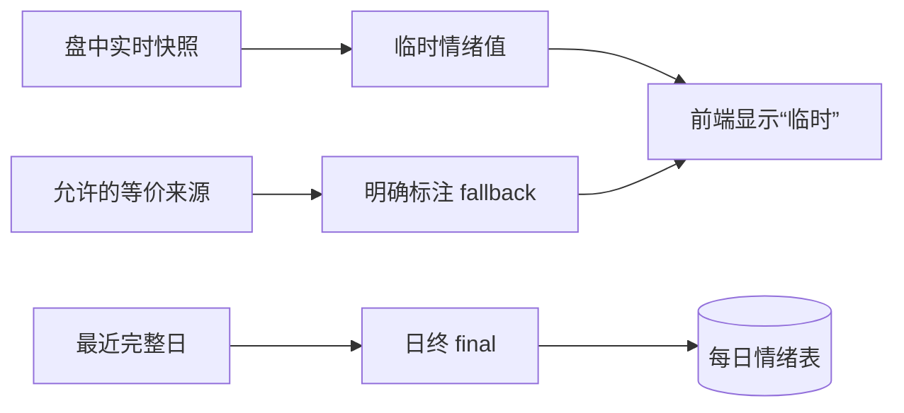

# Agent 编排与业务模块

## Agent 团队怎么工作

主 Agent 是唯一对用户负责的协调入口，按任务启用技术趋势、情绪、基本面、宏观资讯和回测五个分析角色。角色定义、交付字段和冲突处理写在 `agent/agents/`，属于可审计的分析协议，不是后台进程或消息队列。

- 重量任务：盘前、综合复盘、周/月回测、用户专题分析可启用团队。
- 交易日盘后只跑 22:00 综合复盘（T3，团队）；v2.7.0 已取消 17:30 当日总结（T2）。
- 竞价和盘中解释只在用户当前明确请求时执行一轮。
- 服务端量化盯盘可自动运行，但不会自动唤醒 Agent、写记忆或生成交易指令。

## 量化选股

量化选股读取当前因子契约匹配、覆盖率合格、同一运行批次的完整日快照。评分只负责排序，正式候选还要叠加“涨价 > 逻辑 > 预期炒作 > 情绪”的业务门禁。

关键保障：因子契约与筛选运行同事务写入；自动和用户触发样本隔离；调用方不能覆盖服务端固化的评分、排名和契约；候选行情按交易日批量补充并披露缺失。

### 选股必须跟随热点经申万分级行业收窄（v2.5.0）

正式选股（自动 T3/W1 与用户主动方向选股）不得对全市场无差别机械筛选，必须走「当日热点主线 → 申万一级/二级/三级行业 → 行业内量化」的收窄路径：先由消息面、热榜、涨停连板、量能与资金聚类识别当日真正有资金和事件驱动的主线，映射到申万分级行业并用 `screen_sector` 确认行业强度，再在 `screen_quant`/`screen_trend` 传入对应 `industries` 于行业范围内量化。跑出的正式候选必须按 `log_selection` 规范上传服务端（自动 `category=auto`、用户主动 `category=manual`），并在报告正文逐只写明选股理由。仅用户明确要求全市场普筛时才放开行业限制并在报告标注。

## 业务文档落地工作目录与接口指引（v2.6.0）

- **业务文档全量落地工作目录缓存**：初始化与每次任务/角色启动时，先把执行索引、子 Agent 定义（`agents/`）、12 个 Skill（`skills/`）、接口文档（`接口文档/AGENT_SERVICE_GUIDE.md`、`接口文档/SERVICE_INDEX.md`）从工程 `agent/`、`doc/` 同步落地到工作目录缓存 `盯盘/工作文档/`（Coze 左侧 `工作文档/`）再读取内化；缓存是工作产物，不进记忆，文档版本变化时按改动类型刷新。加载后在 `服务状态与能力.md` 记录「工作目录文档地图」，只留最新快照。
- **接口规范就近附带**：每个使用接口的 Skill、子 Agent 定义与定时任务都附「接口速查」（功能名 + 用途 + 关键参数要点）并指向工作目录接口文档，使 AI 随时可查，禁止任何地方说明不明确导致靠猜。
- **定时任务描述结构化**：加载完文档后按工作目录路径生成任务描述，含【工作目标】【结果存放的目录结构】【Agent 编排】【使用的 Skill 和接口文档/索引及工作目录路径】四段。
- **报告接口问题置于文末**：正文只写用户结论，接口失败/降级/缺数统一收敛到报告末尾「🛠️ 数据接口问题」附录，标接口名称、功能、报错信息，仅量化选股（`screen_quant`/`screen_trend`/`screen_sector`）与选股上传（`log_selection`）附请求参数。
- **版本控制本地优先、按改动类型重载**：文档对齐先读本地工程文件、读不到再 git；子 Agent/Skill/接口/索引更新重载工作目录缓存，定时任务定义更新重设日程；记忆只保留最新版本快照。

## 报告表达与产物留存规范（v2.5.0）

- **技能落地工作目录**：初始化与每次任务/角色启动时，先把 12 个 `SKILL.md` 同步到工作目录缓存（v2.6.0 起统一为 `盯盘/工作文档/skills/`，Coze 左侧 `工作文档/skills/`）再读取内化；缓存是工作产物，不写入记忆，文档版本变化时刷新。
- **中间产物不留存**：定时任务（T1/T3/W1/M1/P1）中，子 Agent 的原始意见、逐接口返回、草稿、中间打分表和临时资讯原文只写工作文件根 `tmp/`，任务结束即清理；只有主 Agent 汇总的最终报告与规则允许的业务快照（`daily`、`log_selection`、predictions、学习日志）可以保存。
- **说人话、结论前置、不暴露过程**：面向用户报告只呈现结论与必要依据，严禁输出非结论性思考过程、推理独白、子 Agent 原始意见、逐接口原始返回或未加中文解释的接口名/参数名/因子代码。复盘/研报/选股类报告一眼结论严格按用户视角前置：①今天市场发生了什么 → ②板块行情与大环境（板块强度、轮动、择时顺势仓位）→ ③明天该关注哪些股票（短线 + 趋势核心股、热点龙头、事件受益股）→ ④综合量化/择时/趋势/热点/短线选股结果与逐只理由。

## 量化盯盘

量化盯盘是服务端确定性线程，只在交易日连续竞价运行。数据库租约保证多实例只有一个执行者，fencing token 防止过期实例继续提交，通知事件键防止重复发送，WebSocket 全进程只保留一个广播等待任务，慢客户端只保留最新帧。

## 情绪分析策略

情绪温度综合市场宽度、涨跌停、指数/平均股价的动量、实体、振幅、行业扩散和成交变化。盘中值是临时快照，日终 `final` 才进入每日情绪事实表。极端指数和择时结果由服务端按固定规则计算，Agent 只解释，不自行改公式。

## 前端与后端模块

- 前端：量化选股、量化盯盘、行业、选股看板、自选、情绪、回测、预计算、权重配置。默认界面只给用户决策所需信息，诊断信息不得冒充业务结论。
- 后端：统一鉴权、功能分发、健康与就绪、数据库、缓存、日终调度、盯盘、审计和运行监控。
- 功能脚本：位于 `agent/skills/*/scripts/`，由 `service/loader.py` 自动导入并通过 `@register` 登记。
- 数据版本：功能索引内容变化自动改变 `data_version`；Agent 文档版本由 `AGENT_DOC_VERSION` 独立管理。

## 任务编号

现行 Agent 定时任务仅为 T1（08:30 盘前）、T3（22:00 综合复盘）、W1、M1、P1。**v2.7.0 已取消 T2（17:30 当日总结）**，当天市场复盘统一并入 T3。全市场因子收口由服务端交易日 16:00 执行，不再存在 Agent D1 任务；旧 T6/T7 只属于历史版本，不得重新注册。

17:30 当日总结自 v2.7.0 起取消：交易日盘后只跑 22:00 综合复盘，日报目录固定为 `01-盘前汇总.md`（T1）与 `02-综合复盘.md`（T3）。

## 服务端修复：NaN/Inf 序列化 500（v2.7.0 配套）

数据服务此前对含 pandas `NaN/Inf` 的响应（`macro_*`、`fundamental_*`、`hot_ths`、`market_limit` 等）在 `service/app.py` 的 `_versioned` 用 Starlette `JSONResponse`（`allow_nan=False`）渲染时抛 `ValueError` 返回 HTTP 500。已在 `_versioned` 增加 `_json_safe` 递归清洗，把 `NaN/Inf`（含 numpy 标量）替换为合法 JSON 的 `null`，一处修复全部同类 500，不静默改写正常数值。
