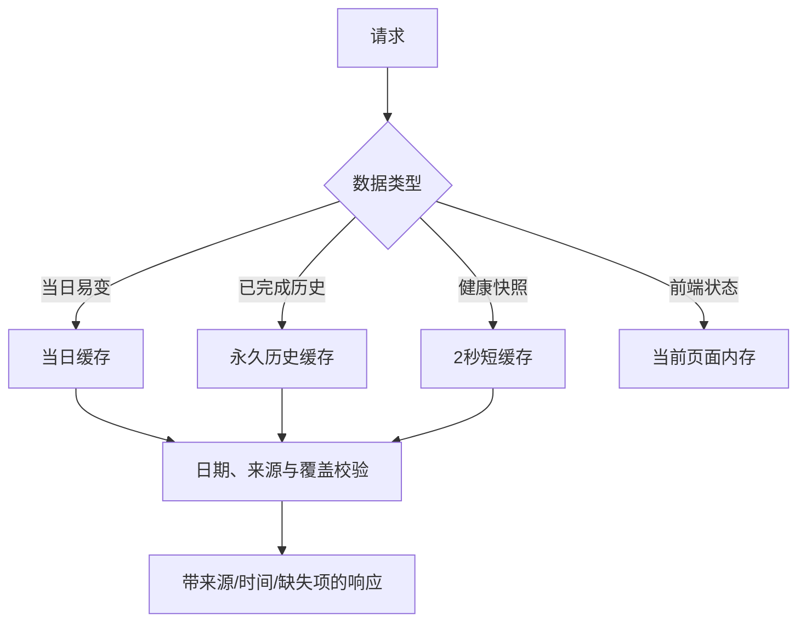

# 数据存储、缓存与一致性

## 数据事实源

| 数据 | 权威位置 | 一致性规则 |
|---|---|---|
| 当前关注与持仓 | `portfolio_items` | 股票代码唯一；同一事务更新内容与 `portfolio_meta` 版本 |
| 正式选股 | `selections` | 日期+代码+类别唯一；auto/manual 首次快照不可变 |
| 因子契约与筛选运行 | `factor_contracts` + `screening_runs` | 同事务固化，防止只有契约或只有运行记录 |
| 完整日因子与行业评分 | `daily_factors` / `daily_sector_scores` | 公式、结构、依赖、运行批次和覆盖率全部匹配才可读 |
| 情绪日终事实 | `daily_sentiment` | 只保存 final；盘中临时值不得冒充日终 |
| 量化盯盘 | 租约、消息、票据、通知事件表 | fencing、一次性消费和事件键幂等 |
| 动态访客 Key | `user_api_keys` | 只存 SHA-256 摘要与展示前缀；完整值不可恢复 |

## 原子性与并发

- `selections` 使用 SQLite `ON CONFLICT` 或 MySQL `ON DUPLICATE KEY UPDATE`，避免先查后插竞争。
- 自选批量上传在一个事务中完成行变更、内容哈希、revision 和响应快照。
- 因子契约和筛选运行通过 `save_screening_snapshot` 在一个事务内提交。
- 量化盯盘依赖数据库租约和 fencing token，过期实例不能覆盖新实例结果。
- 通知以业务事件键认领，避免多实例向同一渠道重复发送。
- 动态 Key 启停使用单条原子更新，不再读取整个 JSON 数组后整体覆盖。

## 缓存分层

- 历史缓存只有在目标日期已完成且覆盖校验通过时才可永久复用。
- 健康快照短时复用，慢探测在锁外执行；探针本身不清理缓存。
- 量化盯盘状态只做亚秒级短缓存，并在数据库提交后主动失效。
- 前端请求序号只用于避免旧响应覆盖新响应，不替代服务端数据版本。

## fallback 规则

数据类接口失败时必须如实失败，披露接口、状态、实际日期和缺失项。只有语义等价、文档明确允许的真实数据路径可以回退，并必须返回 `degraded` 与原因。资讯类可以使用多个财经来源，但重要结论至少双源交叉。

盘中临时值、最近完整日和 fallback 是三种不同口径，界面与报告不得互相冒充。

## 准确性与覆盖

量化候选行情改为按最近六个交易日读取全市场日截面，再过滤候选代码。请求次数不随候选数量线性增长，响应附带目标日、请求次数、覆盖数、缺失代码和错误摘要。行情缺失不会补零，也不会阻止因子排序结果返回。

完整日因子只接受 `success`、覆盖率达标、公式版本/结构哈希/依赖哈希一致且 `run_id` 相同的记录。部分完成、旧版空元数据或当前成分冒充历史成分均不可用。

## 已知技术债

当前数据库升级仍依赖 SQLAlchemy `create_all` 与幂等 `ALTER TABLE`，适合单实例渐进升级，但缺少正式迁移版本、跨实例 DDL 锁、回滚脚本和迁移审计。云上扩容前应引入正式迁移流程，并在独立 RDS 预发布库执行升级、回滚和并发验证。

SQLite 并发单元测试覆盖选股幂等和首次快照不可变；MySQL 原生 upsert 的 `rowcount`、锁等待与隔离级别仍应在预发布 RDS 做集成测试。
